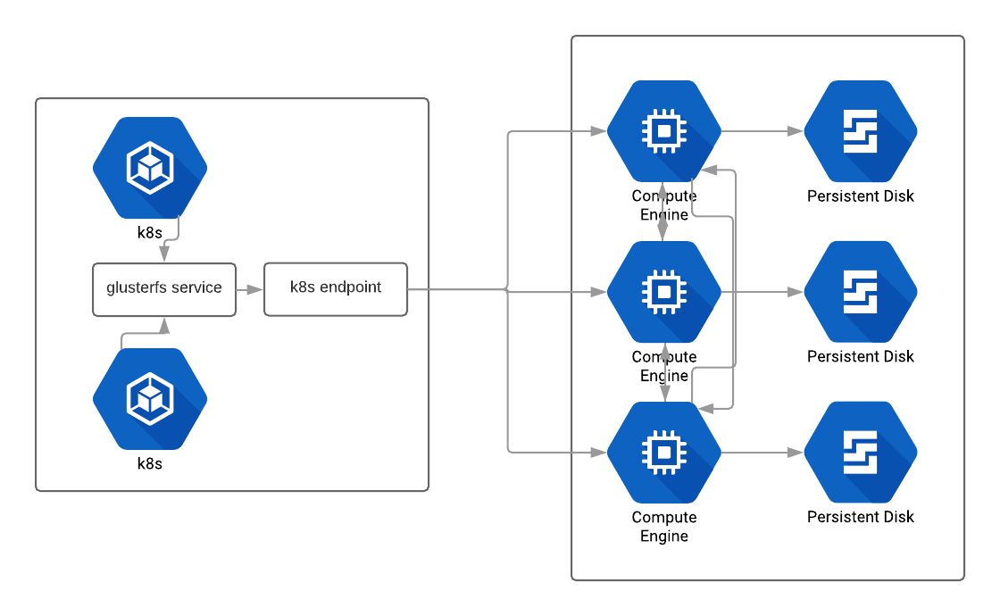

# terraform-glusterfs
This module creates Glusterfs cluster and provides endpoints to use with kubernetes. By default cluster is set to three GlusterFS servers, one server per Google Cloud zone in the same chosen region.



## Prerequisites

Before continuing, please make sure you have:

* A [Google Cloud](https://cloud.google.com) account
* The [Google Cloud SDK](https://cloud.google.com/sdk/) installed

## Compatibility
This module is meant for use with Terraform 0.12. If you haven't upgraded and need a Terraform 0.11.x-compatible version of this module, the last released version intended for Terraform 0.11.x is 1.0.0

## 1. Features

- multi-node glusterfs server is created 
- possibility to create multiple glusterfs volumes
- outputs ready to use kubernetes endpoint config in json
- configurable subnet masks
- configurable disk sizes and types
- configure which network tags will be allowed to access


## 2. Usage:

define cluster module, the example setup can look like::

```hcl
module "cluster" {
  source              = "github.com/erento/terraform-google-glusterfs?ref=2.0.0"
  server_prefix       = "glusterfs-server"
  data_disk_prefix    = "glusterfs-brick"
  subnet_mask         = "10.0.0.0/24"
  ip_offset           = var.ip_offset
  data_disk_size      = "500"
  network             = "your-exisiting-network"
  subnetwork          = "subnetwork-name-that-module-will-create-for-you"
  data_disk_snapshot  = "gluster-snapshot-name"
  data_disk_type      = "pd-standard (can also be pd-ssd if you need speed)"
  volume_names        = ["your-volume-name"]
  tags                = ["gluster", "first_tag", "second_tag"]
  allowed_source_tags = ["gluster", "first_tag", "second_tag"]
}
```

for more settings please look into [variables.tf](variables.tf)

**Important** Please make sure that your main glusterfs tag is defined in allowed_source_tags - this will allow nodes to talk to each other. (by default tags = ["gluster"] and allowed_source_tags = ["gluster"])

### 2.1. Connecting with Kubernetes

1. Apply Kubernetes endpoints and svc files to the cluster:
```
kubectl apply -f glusterfs-endpoints.json
kubectl apply -f files/glusterfs-svc.json
```
IMPORTANT note - to make gluster endpoint work persistently in your kubernetes cluster you need to apply glusterfs-endpoints.json (defined in variable kubernetes_endpoint_file_path) and glusterfs-svc.json (located in files folder)

2. Sample mount in deployment:
```yml
(...)
  spec:
      containers:
      - image: nginx
        (...)
        volumeMounts:
        - mountPath: /mnt/glusterfs
          name: glusterfs-vol
      volumes:
      - name: glusterfs-vol
        glusterfs:
          endpoints: glusterfs-cluster
          path: volume_name
          readOnly: false
```

## 3. Authors

- [Eryk Zalejski](https://github.com/ezalejski)

- [Filip Haftek](https://github.com/filiphaftek)


## 4. License

This project is licensed under the MIT License - see the LICENSE.md file for details.
Copyright (c) 2020 Erento GmbH.

# Acknowledgments

Terraform module is based on [glusterfs-gce repository](https://github.com/rimusz/glusterfs-gce)
